# Awesome Reverse Engineering 

> **Featured: [REA](https://github.com/morluto/rea)** — Agent-oriented reverse-engineering tools, from application behavior to native binaries. By the creators of awesome-reverse-engineering.

[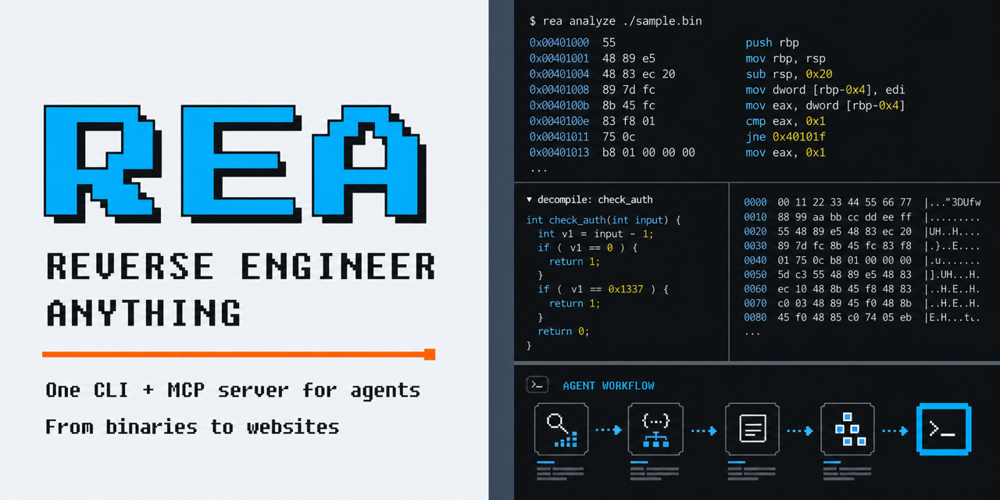](https://github.com/morluto/rea)

A curated starting point for understanding binaries, applications, firmware, file formats, and protocols.

Find a tool by the work you need to do. Each entry describes its purpose; commercial tools are marked **commercial**. This is an initial selection, open to additions and corrections.

## Start here

| Your task | Start with |
| --- | --- |
| Learn assembly and reversing fundamentals | [Learning](#learning) |
| Identify an executable and its capabilities | [File identification and triage](#file-identification-and-triage) |
| Read native code or follow it at runtime | [Native analysis](#native-analysis) and [Debugging and instrumentation](#debugging-and-instrumentation) |
| Examine a suspicious file, process, or memory image | [Malware analysis](#malware-analysis) |
| Inspect an APK, .NET assembly, or Java program | [Android and managed code](#android-and-managed-code) |
| Inspect an iOS app, macOS binary, or Apple firmware | [iOS and macOS](#ios-and-macos) |
| Unpack a Python, Go, Unity, Godot, or obfuscated .NET program | [Language runtimes and packagers](#language-runtimes-and-packagers) |
| Understand browser behavior or an undocumented protocol | [Web and protocols](#web-and-protocols) |
| Extract firmware or inspect a binary format | [Firmware and hardware](#firmware-and-hardware) and [File formats](#file-formats) |
| Compare builds or automate an investigation | [Diffing and analysis frameworks](#diffing-and-analysis-frameworks) and [AI-assisted analysis](#ai-assisted-analysis) |

## Contents

- [Learning](#learning)
  - [Books](#books)
- [File identification and triage](#file-identification-and-triage)
- [Native analysis](#native-analysis)
- [Debugging and instrumentation](#debugging-and-instrumentation)
- [Malware analysis](#malware-analysis)
- [Android and managed code](#android-and-managed-code)
- [iOS and macOS](#ios-and-macos)
- [Language runtimes and packagers](#language-runtimes-and-packagers)
- [Web and protocols](#web-and-protocols)
- [Firmware and hardware](#firmware-and-hardware)
- [File formats](#file-formats)
- [Diffing and analysis frameworks](#diffing-and-analysis-frameworks)
- [AI-assisted analysis](#ai-assisted-analysis)
- [Practice and communities](#practice-and-communities)
- [Related lists](#related-lists)
- [Contributing and maintenance](#contributing-and-maintenance)
- [License](#license)

## Learning

- [Azeria Labs](https://azeria-labs.com/writing-arm-assembly-part-1/) - ARM assembly tutorials with exercises for learning registers, memory, and calling conventions.
- [Compiler Explorer](https://godbolt.org/) - Compiles code in the browser with many compilers and shows the generated assembly, for seeing how source constructs and optimization levels translate to machine code.
- [Nightmare](https://guyinatuxedo.github.io/) - Course built from annotated CTF challenges, progressing from assembly and reversing basics to binary exploitation.
- [OpenSecurityTraining2](https://ost2.fyi/) - Structured courses in assembly, architecture, debugging, and reverse engineering.
- [pwn.college](https://pwn.college/) - Free courses with hands-on challenges in Linux, assembly, reverse engineering, and binary exploitation, run in a browser-accessible environment.
- [Reverse Engineering for Beginners](https://beginners.re/) - Free book connecting compiled C and C++ examples to assembly across several architectures.
- [RPISEC Modern Binary Exploitation](https://github.com/RPISEC/MBE) - Course materials and labs covering reverse engineering, memory corruption, and exploitation.

### Books

- [Hacking the Xbox](https://www.bunniestudios.com/blog/2013/releasing-free-pdf-of-hacking-the-xbox-in-honor-of-aaron-swartz/) - Introduction to hardware reverse engineering through the original Xbox's security design; free PDF edition released by the author.
- [Practical Binary Analysis](https://nostarch.com/binaryanalysis) - Covers ELF and PE internals, disassembly, binary instrumentation, taint analysis, and symbolic execution, with tools built in the exercises.
- [Practical Malware Analysis](https://nostarch.com/malware) - Hands-on introduction to static and dynamic Windows malware analysis with lab exercises; published in 2012, so some tooling chapters are dated.
- [The Ghidra Book](https://nostarch.com/ghidra-book-2e) - Guide to Ghidra's disassembler, decompiler, scripting, and extension APIs; the 2026 second edition covers BSim and PyGhidra.

## File identification and triage

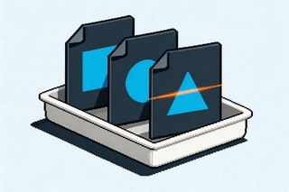

- [capa](https://github.com/mandiant/capa) - Identifies capabilities in executable files using rules over static or dynamic analysis results.
- [Detect It Easy](https://github.com/horsicq/Detect-It-Easy) - Identifies executable formats, compilers, packers, and other file characteristics.
- [FLOSS](https://github.com/mandiant/flare-floss) - Recovers obfuscated strings, including strings constructed on the stack.
- [LIEF](https://github.com/lief-project/LIEF) - Parses and modifies executable formats such as PE, ELF, and Mach-O from code.

## Native analysis

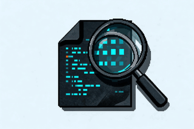

- [Binary Ninja](https://binary.ninja/) - Interactive disassembler and decompiler with intermediate representations and scripting APIs. **Commercial**, with a free edition.
- [Cutter](https://github.com/rizinorg/cutter) - Graphical reverse-engineering interface built on Rizin.
- [Ghidra](https://github.com/NationalSecurityAgency/ghidra) - Disassembly, decompilation, scripting, and headless analysis for native binaries.
- [IDA](https://hex-rays.com/ida-pro) - Interactive disassembler and decompiler with processor modules and a plugin ecosystem. **Commercial**, with a free edition.
- [radare2](https://github.com/radareorg/radare2) - Command-line toolkit for disassembly, binary inspection, debugging, and scripting.
- [Rizin](https://github.com/rizinorg/rizin) - Reverse-engineering framework with command-line analysis and reusable libraries.

## Debugging and instrumentation

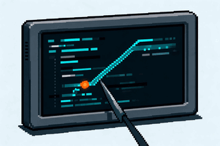

- [Frida](https://github.com/frida/frida) - Injects scripts into running processes to trace calls, inspect data, and change behavior.
- [GDB](https://www.sourceware.org/gdb/) - Native debugger with scripting and remote-debugging support.
- [LLDB](https://lldb.llvm.org/) - LLVM debugger for native programs, including macOS and iOS development workflows.
- [pwndbg](https://github.com/pwndbg/pwndbg) - Debugger extensions for inspecting memory, assembly, and runtime state during binary analysis.
- [rr](https://github.com/rr-debugger/rr) - Records and replays Linux process execution for repeatable debugging.
- [x64dbg](https://github.com/x64dbg/x64dbg) - Windows user-mode debugger for inspecting native executables and libraries.

## Malware analysis

Run samples only in isolated, disposable environments, and follow your organization's handling procedures.

- [CAPE Sandbox](https://github.com/kevoreilly/CAPEv2) - Automated sandbox derived from Cuckoo that runs samples in virtual machines and records behavior, unpacked payloads, and malware configurations.
- [FLARE-VM](https://github.com/mandiant/flare-vm) - Installation scripts that turn a Windows virtual machine into a malware-analysis and reverse-engineering workstation.
- [PE-sieve](https://github.com/hasherezade/pe-sieve) - Scans a running process for injected or modified code, such as hollowed modules, hooks, and shellcode, and dumps what it finds.
- [REMnux](https://remnux.org/) - Linux toolkit for analyzing malicious executables, documents, scripts, and network traffic, available as a virtual machine, container, or installer.
- [Volatility 3](https://github.com/volatilityfoundation/volatility3) - Memory forensics framework for extracting processes, modules, network connections, and other artifacts from memory images.
- [YARA](https://github.com/VirusTotal/yara) - Identifies and classifies files with rules over strings, byte patterns, and file properties; in maintenance mode, with YARA-X as its successor.

## Android and managed code

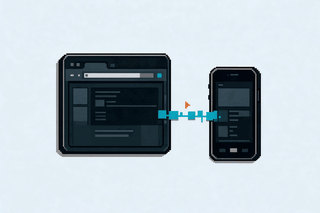

- [Androguard](https://github.com/androguard/androguard) - Python tooling for analyzing Android applications, bytecode, and call relationships.
- [Apktool](https://github.com/iBotPeaches/Apktool) - Decodes Android resources and Smali code, and rebuilds APKs after edits.
- [dnSpyEx](https://github.com/dnSpyEx/dnSpy) - .NET debugger and assembly editor maintained as a continuation of dnSpy.
- [ILSpy](https://github.com/icsharpcode/ILSpy) - .NET assembly browser and decompiler with GUI and command-line interfaces.
- [JADX](https://github.com/skylot/jadx) - Android DEX decompiler with code navigation and search in a graphical interface or CLI.
- [OWASP MASTG](https://mas.owasp.org/MASTG/) - Mobile security testing guidance with Android and iOS reverse-engineering techniques.
- [Recaf](https://github.com/Col-E/Recaf) - Java bytecode analysis and editing environment.

## iOS and macOS

- [class-dump](https://github.com/nygard/class-dump) - Generates Objective-C headers from Mach-O binaries; unmaintained since 2019 and without Swift support, so `ipsw class-dump` is a maintained alternative.
- [Hopper](https://www.hopperapp.com/) - macOS disassembler and decompiler with Objective-C and Swift support, LLDB and GDB debugging, and scripting. **Commercial**, with a free demo.
- [ipsw](https://github.com/blacktop/ipsw) - Command-line toolkit for downloading and examining iOS and macOS firmware, dyld shared caches, kernelcaches, and Mach-O binaries.
- [objection](https://github.com/sensepost/objection) - Frida-based toolkit for exploring iOS and Android apps at runtime, including class inspection, method hooking, and certificate-pinning bypass.

## Language runtimes and packagers

- [Cpp2IL](https://github.com/SamboyCoding/Cpp2IL) - Recovers types, methods, and IL from Unity IL2CPP builds into .NET assemblies and other outputs; described by its author as work in progress.
- [de4dot](https://github.com/de4dot/de4dot) - .NET deobfuscator and unpacker for assemblies protected by common obfuscators; archived in 2020 and no longer updated.
- [GDRE Tools](https://github.com/GDRETools/gdsdecomp) - Recovers Godot projects from exported games, including PCK extraction, GDScript decompilation, and resource conversion.
- [GoReSym](https://github.com/mandiant/GoReSym) - Recovers function names, types, and build metadata from Go binaries, including stripped ones.
- [Il2CppDumper](https://github.com/Perfare/Il2CppDumper) - Restores Unity IL2CPP type and method metadata for use in IDA, Ghidra, and other tools; no commits since July 2024, with Cpp2IL as a maintained alternative.
- [pycdc](https://github.com/zrax/pycdc) - Disassembles and decompiles Python bytecode from `.pyc` files; decompilation of recent Python versions can be incomplete.
- [pyinstxtractor](https://github.com/extremecoders-re/pyinstxtractor) - Extracts the contents of PyInstaller executables, including the bytecode needed for decompilation.

## Web and protocols

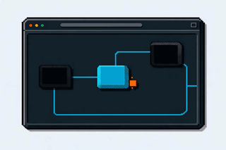

- [Chrome DevTools](https://developer.chrome.com/docs/devtools/) - Browser tools for stepping through JavaScript, inspecting network requests, and examining runtime state.
- [mitmproxy](https://github.com/mitmproxy/mitmproxy) - Intercepts, inspects, and modifies HTTP traffic with interactive tools and Python scripts.
- [WABT](https://github.com/WebAssembly/wabt) - WebAssembly utilities for converting, inspecting, validating, and decompiling modules.
- [webcrack](https://github.com/j4k0xb/webcrack) - Deobfuscates JavaScript and unpacks common bundler output to make code easier to inspect.
- [Wireshark](https://www.wireshark.org/) - Captures and dissects network traffic for protocol investigation.

## Firmware and hardware

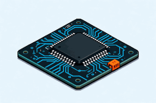

- [Binwalk](https://github.com/ReFirmLabs/binwalk) - Identifies embedded files and extracts content from firmware images.
- [OFRAK](https://github.com/redballoonsecurity/ofrak) - Framework for unpacking, analyzing, modifying, and repacking binary artifacts.
- [OpenOCD](https://openocd.org/) - Connects to hardware debug interfaces for on-chip debugging and flash access.
- [sigrok](https://sigrok.org/) - Signal analysis tools and protocol decoders for logic analyzers and related hardware.
- [UEFITool](https://github.com/LongSoft/UEFITool) - Parses UEFI firmware structures and extracts or replaces modules.
- [unblob](https://github.com/onekey-sec/unblob) - Extracts nested archives, compressed data, and filesystem images from firmware and other files.

## File formats

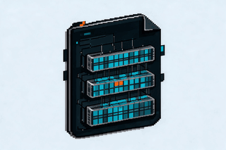

- [010 Editor](https://www.sweetscape.com/010editor/) - Hex editor with binary templates for inspecting structured files. **Commercial**.
- [ImHex](https://github.com/WerWolv/ImHex) - Hex editor with a pattern language for describing and exploring binary structures.
- [Kaitai Struct](https://kaitai.io/) - Describes binary formats declaratively and generates parsers in multiple languages.

## Diffing and analysis frameworks

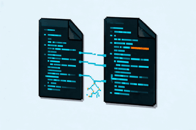

- [angr](https://github.com/angr/angr) - Python framework for symbolic execution and program analysis.
- [BinDiff](https://github.com/google/bindiff) - Compares disassembled binaries to identify similar functions and changes between builds.
- [Capstone](https://github.com/capstone-engine/capstone) - Multi-architecture disassembly library for building analysis tools.
- [Diaphora](https://github.com/joxeankoret/diaphora) - Binary diffing plugin for comparing functions and transferring analysis in IDA.
- [Qiling](https://github.com/qilingframework/qiling) - Emulates binaries with operating-system services for scripted runtime analysis.
- [Unicorn](https://github.com/unicorn-engine/unicorn) - CPU emulation library for executing and instrumenting machine code across architectures.

## AI-assisted analysis

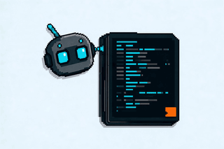

Agent integrations expose existing analysis tools or coordinate an investigation. Check the upstream documentation for required software and supported clients; confirm conclusions against the underlying code and runtime evidence.

- [Ghidra MCP Server](https://github.com/bethington/ghidra-mcp) - Connects AI clients to Ghidra analysis through MCP.
- [IDA Pro MCP](https://github.com/mrexodia/ida-pro-mcp) - Exposes IDA analysis and scripting capabilities to MCP clients; requires a compatible IDA installation.
- [JADX-AI-MCP](https://github.com/zinja-coder/jadx-ai-mcp) - Connects AI clients to JADX for Android application analysis.
- [radare2 MCP](https://github.com/radareorg/radare2-mcp) - Provides an MCP interface to radare2 for agent-driven binary analysis.

## Practice and communities

- [crackmes.one](https://crackmes.one/) - Practice binaries organized by platform, architecture, and difficulty.
- [FLARE-On](https://flare-on.com/) - Annual reverse-engineering challenge series with previous challenges and solutions.
- [Reverse Engineering Stack Exchange](https://reverseengineering.stackexchange.com/) - Questions and answers about tools, assembly, executable formats, and analysis techniques.

## Related lists

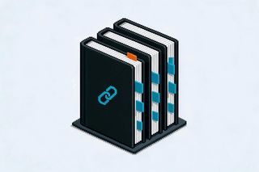

See the [list structure and maintenance review](docs/list-review.md) for a dated comparison of 21 general and specialist collections. Recent activity and popularity are assessed separately there.

- [Awesome AI Reverse Engineering](https://github.com/DiscoverBox/awesome-ai-reverse) - AI integrations organized by analysis ecosystem, with English and Chinese editions.
- [Awesome Embedded Security](https://github.com/hexsecs/awesome-embedded-security) - Firmware and hardware tools, learning resources, and repository-health workflows.
- [Awesome Game File Format Reversing](https://github.com/VelocityRa/awesome-game-file-format-reversing) - Game formats, engines, asset tools, and specialist references.
- [Awesome Reversing by Reversing.ID](https://github.com/ReversingID/Awesome-Reversing) - Separate catalogs for software, hardware, formats, and databases.
- [Awesome Reverse Engineering and Malware Analysis](https://github.com/ZX41R/awesome-reverse-engineering-and-malware-analysis) - Topic pages spanning reversing, malware analysis, and related research.
- [Awesome Web Reversing](https://github.com/TheQmaks/awesome-web-reversing) - Web investigation workflows and a machine-readable tool catalog.

## Contributing and maintenance

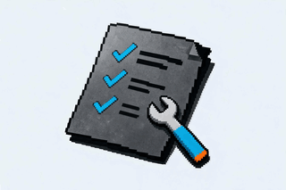

Read [CONTRIBUTING.md](CONTRIBUTING.md) to suggest a resource or fix an entry. Prefer canonical project links and descriptions that explain when a resource is useful.

Links are checked on pull requests, pushes to the default branch, and weekly by [GitHub Actions](.github/workflows/links.yml). A passing link check confirms availability, not tool quality or maintenance; review archived projects, compatibility changes, and replacements when updating entries.

## License

[CC0 1.0](LICENSE). Listed projects retain their own licenses.
